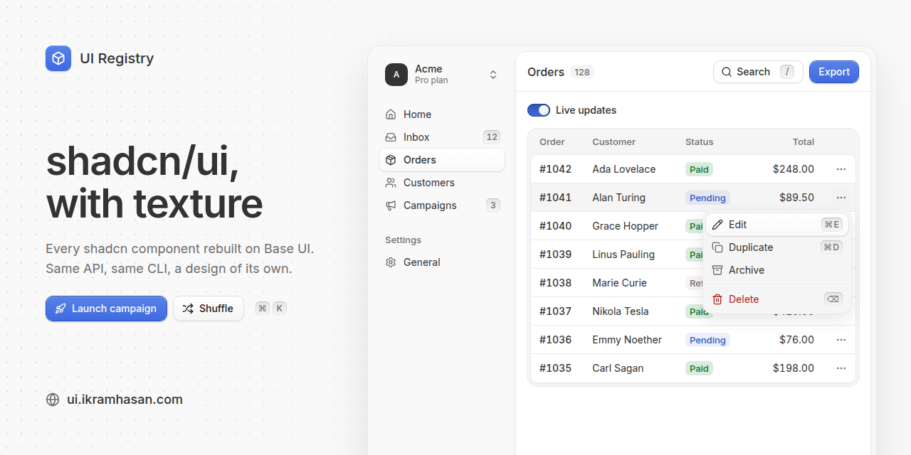

# UI Registry

[](https://ui.ikramhasan.com)

shadcn components rebuilt on [Base UI](https://base-ui.com) with our own design (see `DESIGN.md`), distributed through the [shadcn CLI](https://ui.shadcn.com/docs/registry/getting-started). Each component is a drop-in for its shadcn `base-nova` counterpart: same file name, exports, props, variants, sizes, `data-slot` attributes and Base UI primitive. Only the styling changes.

## Installing

```bash
# once: the theme variables and the Inter font
npx shadcn@latest add http://localhost:3000/r/style.json

# then any component
npx shadcn@latest add http://localhost:3000/r/button.json
```

Components only use the standard shadcn variables (`--primary`, `--secondary`, `--accent`, `--input`, `--ring`, …), so they also work with any other shadcn theme. Colors the design needs beyond those, like the button gradients, are derived in the component with `color-mix()`, the way base-nova does it. The one added color, `--success`, follows shadcn's "adding new colors" pattern.

## Components

Every `registry:ui` item in shadcn's base-nova registry (63 total, from https://ui.shadcn.com/r/styles/base-nova/registry.json). Tick a box when the component is in `registry/ui/`, in `registry.json` and has a docs page.

**Progress: 51 / 63**

- [x] Accordion (`accordion`)
- [x] Alert (`alert`)
- [x] Alert Dialog (`alert-dialog`)
- [ ] Aspect Ratio (`aspect-ratio`)
- [x] Attachment (`attachment`)
- [ ] Avatar (`avatar`)
- [x] Badge (`badge`)
- [x] Breadcrumb (`breadcrumb`)
- [x] Bubble (`bubble`)
- [x] Button (`button`)
- [x] Button Group (`button-group`)
- [x] Calendar (`calendar`)
- [x] Card (`card`)
- [ ] Carousel (`carousel`)
- [ ] Chart (`chart`)
- [x] Checkbox (`checkbox`)
- [x] Collapsible (`collapsible`)
- [ ] Combobox (`combobox`)
- [x] Command (`command`)
- [x] Context Menu (`context-menu`)
- [x] Dialog (`dialog`)
- [ ] Direction (`direction`)
- [x] Drawer (`drawer`)
- [x] Dropdown Menu (`dropdown-menu`)
- [x] Empty (`empty`)
- [x] Field (`field`)
- [ ] Form (`form`)
- [x] Hover Card (`hover-card`)
- [x] Input (`input`)
- [x] Input Group (`input-group`)
- [ ] Input OTP (`input-otp`)
- [x] Item (`item`)
- [x] Kbd (`kbd`)
- [x] Label (`label`)
- [x] Marker (`marker`)
- [x] Menubar (`menubar`)
- [x] Message (`message`)
- [x] Message Scroller (`message-scroller`)
- [ ] Native Select (`native-select`)
- [ ] Navigation Menu (`navigation-menu`)
- [x] Pagination (`pagination`)
- [x] Popover (`popover`)
- [x] Progress (`progress`)
- [x] Questionnaire (`questionnaire`)
- [x] Radio Group (`radio-group`)
- [ ] Resizable (`resizable`)
- [x] Scroll Area (`scroll-area`)
- [x] Select (`select`)
- [x] Separator (`separator`)
- [x] Sheet (`sheet`)
- [x] Sidebar (`sidebar`)
- [x] Skeleton (`skeleton`)
- [x] Slider (`slider`)
- [x] Sonner (`sonner`)
- [x] Spinner (`spinner`)
- [x] Switch (`switch`)
- [x] Table (`table`)
- [x] Tabs (`tabs`)
- [x] Textarea (`textarea`)
- [ ] Toast (`toast`)
- [x] Toggle (`toggle`)
- [x] Toggle Group (`toggle-group`)
- [x] Tooltip (`tooltip`)

Guides built from those components (shadcn ships them as docs pages, not registry items):

- [x] Data Table (`data-table`, on Table with TanStack Table v9)

## Structure

A pnpm workspace laid out like [shadcn/ui](https://github.com/shadcn-ui/ui), whose site lives in `apps/v4`. This is the first version, so the site is `apps/v1`.

```
apps/v1
├── app/                  # Next.js routes: home, docs, blocks, charts
│   └── (app)/docs/       # the docs, rendered from content/docs
├── components/           # site chrome: header, docs sidebar, previews, code blocks
├── content/docs/         # MDX: Getting Started pages and one page per component
├── examples/             # one file per example shown in the docs
│   └── __index__.tsx     # generated by registry:build
├── lib/                  # config, site URL, page tree, registry and highlighting helpers
├── registry/ui/          # component sources: what the CLI installs
├── registry.json         # registry items
└── scripts/build-registry.mjs
```

Blocks and Charts are placeholders until every component has shipped. The docs are complete.

## Development

```bash
pnpm install
pnpm dev            # the site at http://localhost:3000 (builds the registry first)
pnpm registry:build # regenerates examples/__index__.tsx and public/r/*.json
pnpm build          # registry + production build
pnpm lint
pnpm typecheck
```

## Registry URL

`registry.json` and the docs are written against `http://localhost:3000`. At build and render time that URL is replaced with the site's own (`apps/v1/lib/site-url.mjs`):

1. `NEXT_PUBLIC_APP_URL`, when set.
2. On Vercel: the production domain for production deploys, the deployment URL for previews. Vercel sets these, so no configuration is needed.
3. `http://localhost:3000` otherwise.

That covers the JSON the CLI downloads (`homepage` and every `registryDependencies` URL) and every install command and link in the docs. On another host, set `NEXT_PUBLIC_APP_URL=https://your-domain` for the build.

## Deploying

Deploy `apps/v1` as a Next.js app. On Vercel, set the project's **Root Directory** to `apps/v1` (Settings → Build and Deployment) and keep "Include files outside the root directory" on, so the workspace lockfile is used. The build command is the app's `pnpm build`, which builds the registry first.

## Adding a component

1. Install the upstream one for reference: `pnpm exec shadcn add <name>` (base-nova, from `apps/v1`). Read it, then delete it.
2. Recreate it in `apps/v1/registry/ui/<name>.tsx` with the same API, restyled per `DESIGN.md`.
3. Add an item to `apps/v1/registry.json` with the same `dependencies` as upstream.
4. Add examples to `apps/v1/examples/` (`<name>-demo.tsx` plus one file per variant or state), then run `pnpm registry:build`.
5. Write `apps/v1/content/docs/components/<name>.mdx` (copy an existing page) and add it to `content/docs/components/meta.json`.

A component that uses another one of ours (e.g. Dialog uses Button) lists it in `registryDependencies` by **full URL** (`http://localhost:3000/r/button.json`; the build swaps in the real one). A bare name like `"button"` resolves to shadcn's own registry and would install shadcn's button instead of ours.
